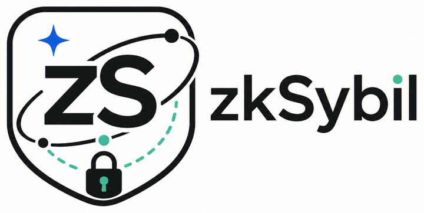

# zkSybil



zkSybil is a privacy-preserving proof-of-personhood layer for Stellar
applications that need to enforce "one eligible human, one action" without
turning identity into public on-chain data.

The project targets a common problem in open crypto programs: airdrops,
allowlists, quadratic funding rounds, community grants, and anti-abuse gates
need sybil resistance, but they should not require every participant to reveal
their real identity to each application they use. zkSybil addresses this by
separating eligibility from participation. An issuer verifies users off-chain
and adds identity commitments to a registry. Applications then verify zero-
knowledge membership proofs against a scoped Merkle root, store a scoped
nullifier, and reject duplicate claims without learning which registered person
submitted the proof.

At a product level, zkSybil gives Stellar builders a reusable pattern for
private eligibility gates:

- **One-person enforcement:** a scoped nullifier makes repeat claims impossible
  inside a campaign, round, or app-specific scope.
- **Privacy by design:** users prove membership locally; secrets, trapdoors,
  Merkle paths, and identity details never need to be posted on-chain.
- **Cross-app unlinkability:** nullifiers are scope-specific, so a user's claim
  in one program is not linkable to their claim in another.
- **Composable app gate:** `AppGate` can sit in front of airdrops, allowlists,
  grant rounds, or other Soroban workflows that need proof-backed eligibility.
- **Auditable evidence:** deployments, root updates, scope creation, accepted
  claims, replay rejection, and read-back state are captured as verifiable
  Stellar testnet artifacts.

The long-term vision is to make zkSybil a practical privacy primitive for
Stellar ecosystems: a small, auditable module that lets applications consume
human uniqueness signals without becoming identity databases. Instead of every
app rebuilding its own KYC, allowlist, or anti-farming logic, zkSybil provides a
shared proof layer where issuers manage eligibility and applications only verify
the minimum facts they need.

## Status

Current state: **testnet claim succeeded**.

The latest recorded run in `evidence/testnet-latest.json` contains a complete
Stellar testnet lifecycle:

- Identity commitment registered.
- Merkle root published.
- AppGate scope opened.
- UltraHonk proof claim accepted.
- Replay attempt rejected with `AlreadyClaimed #4`.
- Contract read-back confirms `hasClaimed = true`.

The web demo is an evidence viewer over this recorded testnet run. It does not
sign transactions and does not live-fetch Horizon/RPC in the browser.

## Demo

- Video walkthrough: https://youtu.be/BGh-fqsB4Ho
- Web demo: https://zksybil.vercel.app
- GitHub: https://github.com/liamtren21/zksybil

## Why It Matters

Most sybil-resistant workflows need two properties that are often in tension:

- An issuer or verification process decides who is eligible.
- An application must enforce "one person, one claim" without learning the
  user's identity.

zkSybil separates those concerns:

1. The issuer adds identity commitments to `IdentityRegistry`.
2. The app opens a scope in `AppGate` against a specific Merkle root.
3. The user proves membership locally with Noir.
4. `AppGate` verifies the proof and stores a scoped nullifier.
5. A second claim using the same scoped nullifier is rejected.

Important trust boundary: zkSybil proves membership in an issuer-managed set.
It does not make the issuer process sybil-resistant by itself.

## Architecture

```text
Issuer
  |
  | add_identity(commitment)
  v
IdentityRegistry (Soroban)
  |
  | publish root
  v
AppGate (Soroban)
  |
  | open_scope(root, expected signal, claim amount)
  v
User local prover
  |
  | Noir membership proof + public inputs
  v
UltraHonk verifier on Soroban
  |
  | accept first scoped nullifier, reject replay
  v
Claim state
```

Core components:

- `circuits/sybil`: Noir circuit for membership, scoped nullifier, and signal
  binding.
- `scripts/merkle.ts`: deterministic Merkle tree utilities for fixture and
  proof generation.
- `contracts/registry`: issuer-managed identity commitment registry.
- `contracts/appgate`: scope configuration, public-input checks, proof
  verification, claim recording, and replay rejection.
- `web`: React evidence workspace for the successful testnet run.

## Verified Testnet Evidence

Network: Stellar testnet

| Item | Value |
| --- | --- |
| Deployer | `GB4W3UIOBSERQ45D5KU2L56WN4CZJBOKR7KXUH4QFCW2TACCZJOOBH43` |
| IdentityRegistry | `CAK2VSEXALZFHKMVFSKSOZCGCXVMNMP3PFZZESQ2CUQE56KYEXKWOETT` |
| AppGate | `CDKI46P4E43ZG2565G74IKPYKQF3XFLLKJ6T72DXFG4HMJAUKRXKYPBD` |
| Merkle root | `1ff883b48bf9790f23d52d773d7027f1de792fe6dc778c014b2013fab16c233b` |
| Scope domain | `16877ebce6f9b795771a4210b7ddf9902e2226ca8fda4d0dd7dbb4555dbaabd4` |
| Nullifier | `2da67992a69a96a1b3b48ca195d136b80134c884f59bac02b153ac489629485c` |
| Claim status | `SUCCESS` |
| Replay result | `AlreadyClaimed #4` |

Explorer links:

- IdentityRegistry:
  <https://stellar.expert/explorer/testnet/contract/CAK2VSEXALZFHKMVFSKSOZCGCXVMNMP3PFZZESQ2CUQE56KYEXKWOETT>
- AppGate:
  <https://stellar.expert/explorer/testnet/contract/CDKI46P4E43ZG2565G74IKPYKQF3XFLLKJ6T72DXFG4HMJAUKRXKYPBD>
- Register identity transaction:
  <https://stellar.expert/explorer/testnet/tx/8f56b90099f38feee4cae851c37cb0257f1f29611947d10f47dd58d538de6870>
- Publish root transaction:
  <https://stellar.expert/explorer/testnet/tx/2198f64f789d86a7d103a19cb145081ab4ecf32abde7130b2dfdf81ee2447b95>
- Open scope transaction:
  <https://stellar.expert/explorer/testnet/tx/9517fd1c00bb6bc046644ca6c3962c7bb3fa95eef6fb9c805b8a3bb0fda3d950>
- Claim transaction:
  <https://stellar.expert/explorer/testnet/tx/a73d6109f63a388d240d4308ccb18b5320dc2f802547739b53b480edb6167ce8>

## On-Chain vs Local Evidence

On-chain/testnet evidence:

- Contract IDs.
- Transaction hashes.
- Published Merkle root.
- Opened scope configuration.
- Accepted claim transaction.
- Replay rejection.
- Read-back state: root, scope configuration, and `hasClaimed`.

Local proof artifacts bound to the testnet run:

- Identity commitment.
- Public inputs.
- Verification key hash.
- Proof hash.
- Merkle witness and private identity inputs.

Private data that must stay off-chain:

- Identity secret.
- Identity trapdoor.
- Merkle path.
- Full private witness.

## Public Input Order

The AppGate verifier reconstructs and checks public inputs before invoking the
UltraHonk verifier.

```text
root
scope_domain
nullifier
signal_hash
```

Mutation checks are included to reject modified public input encodings.

## Prerequisites

Recommended environment: WSL/Linux.

Required tools:

- Node.js and npm.
- Rust and Cargo.
- Stellar CLI with Soroban support.
- Noir `nargo`.
- Barretenberg `bb`.

This repository includes local tool artifacts under `artifacts/` for the
recorded run, but a fresh environment may need its own PATH setup for `nargo`,
`bb`, `stellar`, and `cargo`.

## Install

```bash
npm install
cd web && npm install && cd ..
```

For testnet operations, copy the environment template:

```bash
cp .env.example .env
```

Then configure the Stellar source account and any deployment-specific values.
Do not commit funded keys or local secrets.

## Run Verification

Fast project test suite:

```bash
npm test
```

Build the web evidence workspace:

```bash
npm run web:build
```

Proof fixture:

```bash
bash scripts/prove-fixture.sh
```

Public-input mutation checks:

```bash
bash scripts/verify-public-input-mutations.sh
```

Soroban contract tests:

```bash
cargo test --manifest-path contracts/registry/Cargo.toml
cargo test --manifest-path contracts/appgate/Cargo.toml
```

Production contract builds:

```bash
stellar contract build --manifest-path contracts/registry/Cargo.toml
stellar contract build --manifest-path contracts/appgate/Cargo.toml
```

Combined local verification helper:

```bash
bash run_verifications.sh
```

## Testnet E2E

The testnet script deploys or uses configured contracts, registers an identity,
publishes a root, opens a scope, submits a proof-backed claim, attempts replay,
and writes the evidence snapshot.

```bash
bash scripts/testnet-e2e.sh
```

Output:

```text
evidence/testnet-latest.json
web/src/evidence.json   # copied during web prebuild
```

The current checked-in evidence snapshot is already successful. Re-running the
script requires funded testnet credentials and a working Stellar CLI setup.

## Web Demo

Start the local development server:

```bash
npm run web:dev
```

Build a production bundle:

```bash
npm run web:build
```

Preview the built bundle:

```bash
cd web
npm run preview
```

The demo is intentionally local-only in this workspace. It displays verified
testnet evidence and lets reviewers replay the claim lifecycle in the UI, but it
does not submit new transactions.

## Repository Layout

```text
zksybil/
  circuits/sybil/                 Noir circuit and fixture inputs
  contracts/registry/             IdentityRegistry Soroban contract
  contracts/appgate/              AppGate Soroban contract
  scripts/                        Merkle, proof, deploy, and E2E scripts
  evidence/testnet-latest.json    Latest verified testnet evidence snapshot
  web/                            React evidence workspace
```

## Security Notes

- The issuer controls who enters the identity set. A weak issuer creates weak
  sybil resistance.
- Scoped nullifiers protect against replay inside one scope, but app designers
  must choose domain-separated scope values.
- Signal binding should represent the actual action or recipient being claimed,
  not arbitrary UI text.
- Private witness data must never be posted on-chain or committed to the repo.
- The web app is a read-only evidence demo; it is not a wallet or signing UI.

## Current Verification Snapshot

Last verified locally in this workspace:

```text
npm test          -> 6 files, 22 tests passed
npm run web:build -> production build passed
browser smoke     -> claim lifecycle reached "Claim accepted, replay rejected"
```
